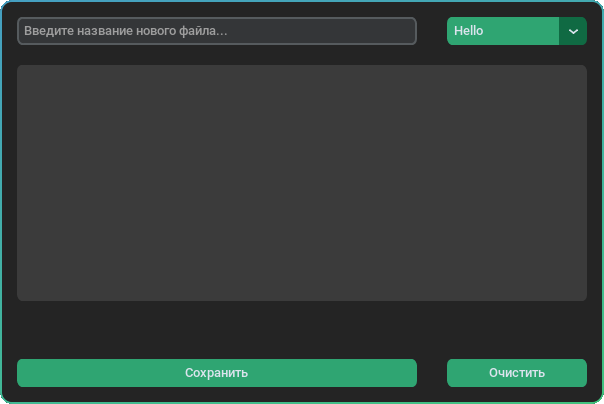
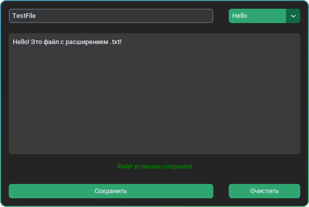

<div align="center">


[](https://github.com/python3demon/NoteApp.git)
[](https://www.python.org/downloads/)
[](https://pypi.org/project/customtkinter/)
[](https://kernel.org)

</div>

<div align="center">
	<h1>
		NoteApp — Удобный редактор
	</h1>
</div>

## Заметки без лишнего. Просто. Быстро.
Это приложения создано для тех кто хочет максимальную скорость и при этом не тратить время на открытие документации и заучивания комбинаций клавиш.

## Дорожная карта
### В ближайших версиях
- [ ] Полный рефакторинг архитектуры приложения (v0.2.0-alpha)
	- [x] Разработка базового прототипа интерфейса
	- [ ] Перенос процедурного кода в ООП-классы
	- [ ] Избавление от глобальных переменных и изоляция логики сохранения
- [ ] Добавления базовых инструментов
	- [ ] Добавление базовых сочетаний клавиш (например `Ctrl + S` для сохранение файла)

## Возможности редактора

<table>
  <tr>
    <td></td>
    <td></td>
  </tr>
</table>


С помощью этого редактора вы можете создать файл с нужным именем и сохранить его!
Что бы выбрать один из не давних файлов вы можете воспользоватся кнопкой которая находится в правом верхнем углу, если же хотите создать файл то можете ввести название в поле которое находится левее.

> [!IMPORTANT]
> Абслютно любая комбинация клавиш не работает!

Так как еще комбинации клавиш еще не было добавлено вы можете сохранить через кнопку сохранить.

## Установка
### Windows
Для начала откройте командную строку (нажмите <kbd>Win</kbd> + <kbd>R</kbd>, введите `cmd` и нажмите <kbd>Enter</kbd>).
```batch 
:: Клонирование репозитория и переход в папку
git clone https://github.com/python3demon/NoteApp.git && cd EasyNoteApp

:: Ставим виртуальное окружение и активируем
python -m venv venv
call venv\Scripts\activate.bat

:: Устанавливаем зависимости
pip install -r requirements.txt

:: Запуск приложения
python main.py
```

### Linux
```shell
# Клонирование репозитория и переход в директорию
git clone https://github.com/python3demon/NoteApp.git && cd NoteApp

# Ставим виртуальное окружение и активируем
python3 -m venv venv
source venv/bin/activate

# Устанавливаем зависимости
pip install -r requirements.txt

# Запуск приложения
python main.py
```

## 📜 Лицензия
Этот проект распространяется под индивидуальной этической лицензией автора. Использование программного обеспечения допускается строго в рамках норм и принципов Шариата.
Полный текст правил и условий читайте в файле [LICENSE](https://github.com/python3demon/python3demon/blob/main/LICENSE) в моем глобальном профиле.
